# Mekina - Car Auction & Marketplace MVP

**Mekina** is a full-stack platform designed to simplify the process of buying, selling, and renting cars. It features a robust auction system, direct dealer-buyer communication, and a user-friendly mobile interface.

## ✨ Key Features

- **🚗 Car Listings**: Browse cars for **Sale**, **Rent**, or **Auction**.
- **💬 Real-Time Chat**: Chat directly with dealers to negotiate prices or ask questions.
- **🔔 Live Notifications**: Get instant updates on your bids, messages, and requests.
- **⚡ Dealer Dashboard**: A dedicated space for dealers to manage inventory, view leads, and track performance.
- **🔍 Smart Search**: Filter cars by make, model, price, condition, and more.
- **🛡️ Secure Auth**: Role-based access for Buyers, Dealers, and Admins.

## 📸 Screenshots

| :-----------------------------------------------------------------------------------: | :---------: | :------------: |
| 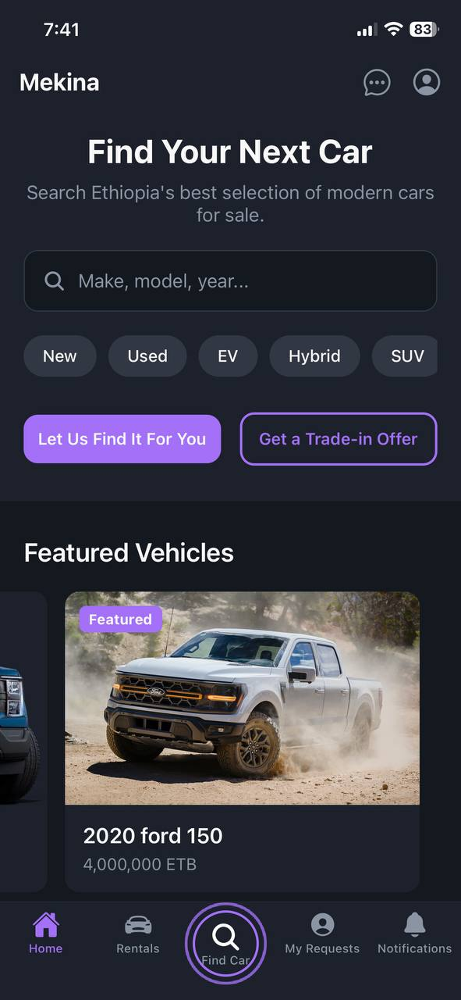 |
|  |
| 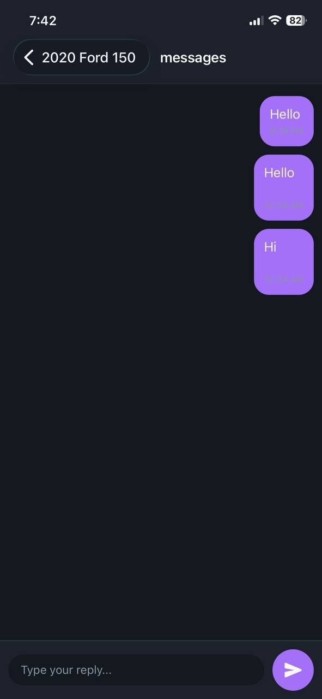 |
| 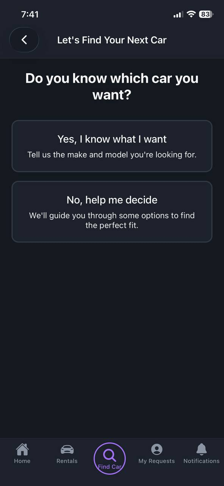 |
| 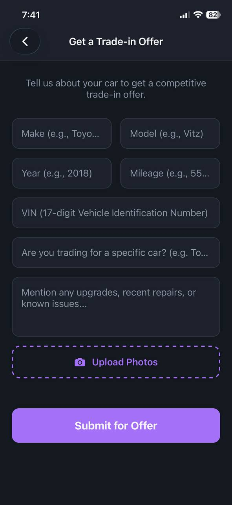 |
| 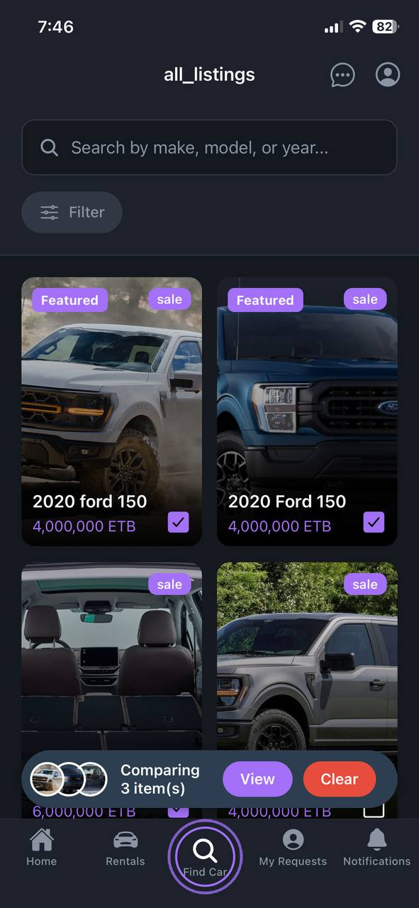 |
| 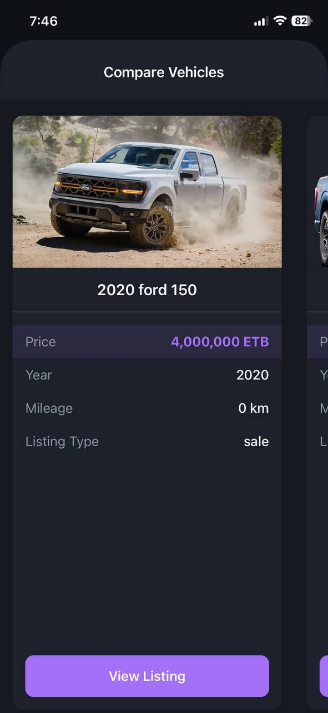 |
| 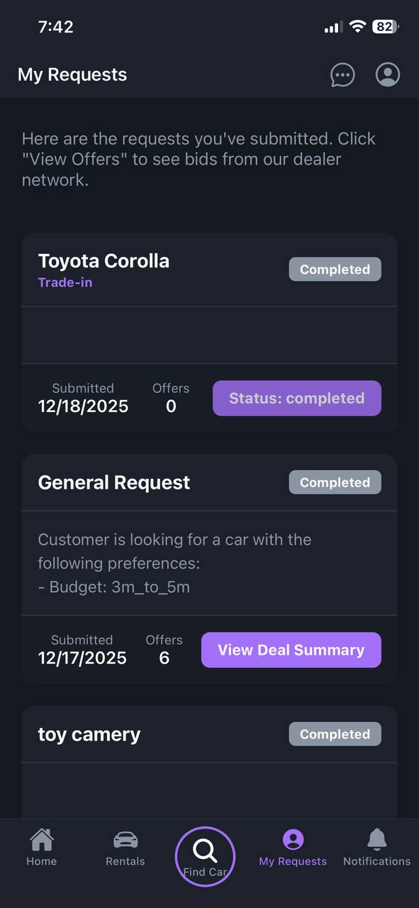 |
| 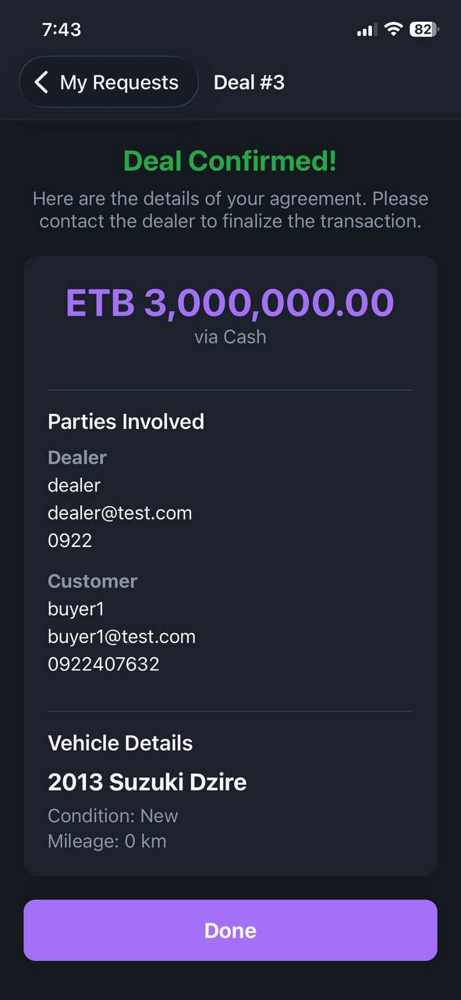 |
| 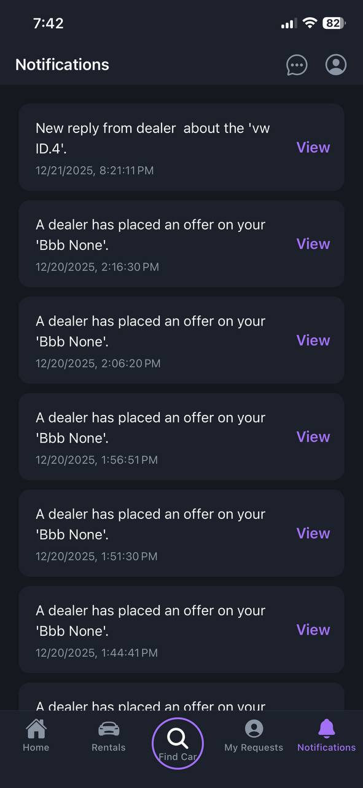 |
| 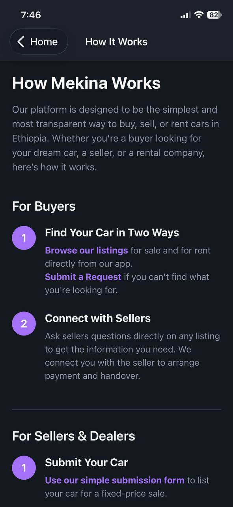 |
| 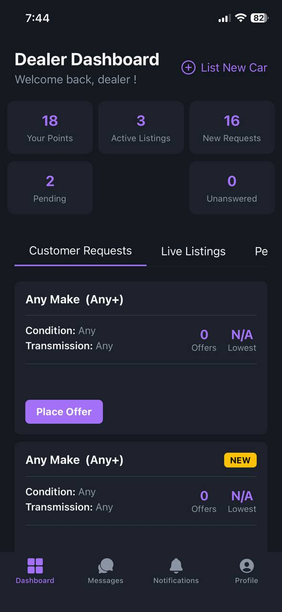 |
| 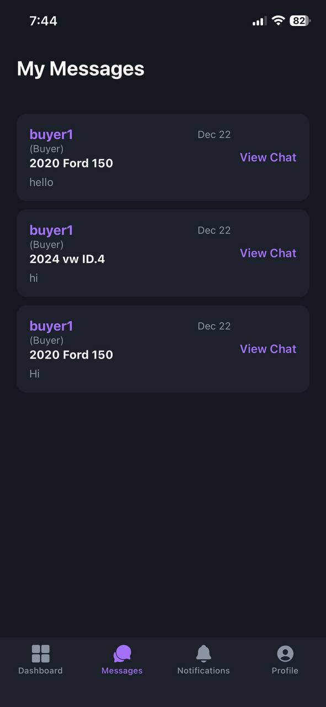 |
| 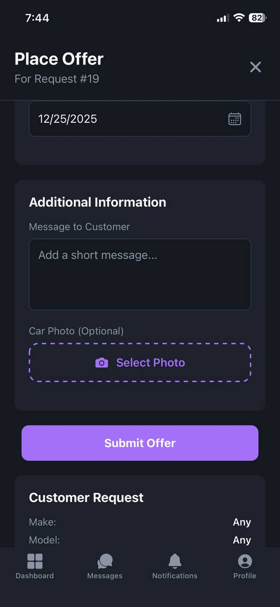 |
| 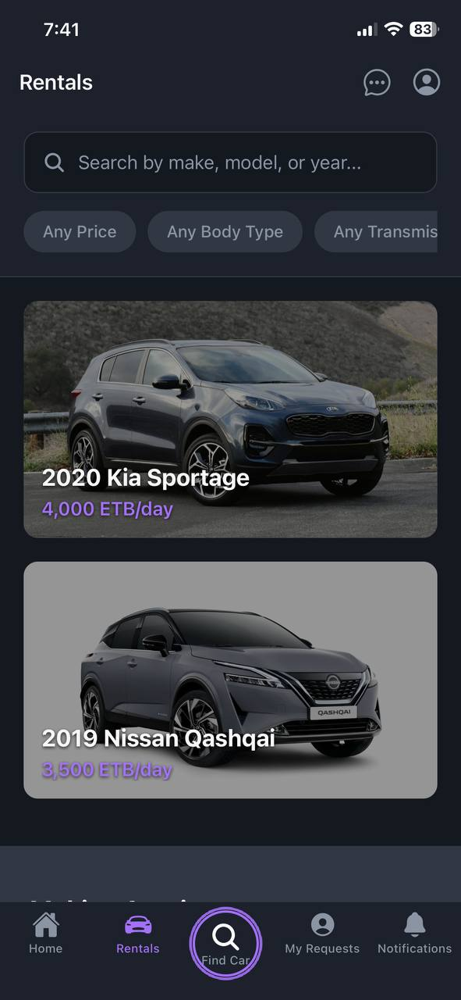 |
| 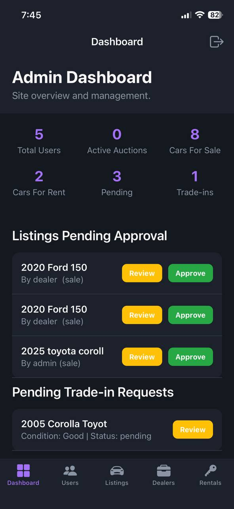 |
| 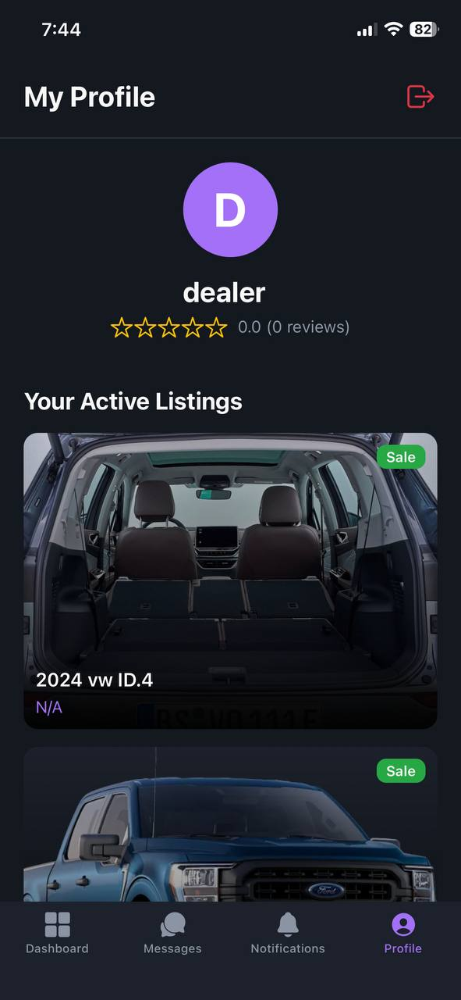 |
|  |

## 🏗️ Tech Stack

### Backend (Server)

- **Language**: Python
- **Framework**: Flask
- **Database**: SQLAlchemy (SQLite/PostgreSQL)
- **Real-time**: Flask-SocketIO
- **Auth**: JWT & Flask-Login

### Frontend (Web)

- **Templating**: Jinja2 (HTML)
- **Styling**: CSS / Bootstrap

### Frontend (Mobile App)

- **Framework**: React Native (Expo)
- **Language**: TypeScript
- **Routing**: Expo Router
- **HTTP Client**: Axios

## 📐 Architecture

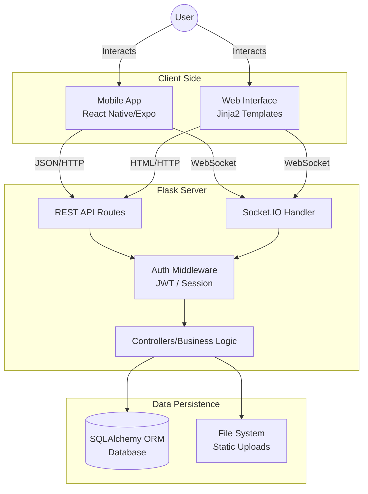

## � Getting Started

Follow these instructions to set up the project on your local machine.

### Prerequisites

- **Node.js** & **npm** installed.
- **Python 3.8+** installed.
- **Expo Go** app installed on your phone (optional, for testing).

### 1️⃣ Backend & Web App Setup

1.  Open your terminal and navigate to the project root folder.
2.  Create a virtual environment to keep dependencies isolated:
    ```bash
    python -m venv venv
    ```
3.  Activate the virtual environment:
    - **Windows**: `venv\Scripts\activate`
    - **Mac/Linux**: `source venv/bin/activate`
4.  Install the required Python packages:
    ```bash
    pip install -r requirements.txt
    ```
5.  Start the backend server:
    ```bash
    python app.py
    ```
    _The server usually runs on `http://0.0.0.0:5001`. You can access the web app at `http://localhost:5001`._

### 2️⃣ Mobile App Setup

1.  Open a new terminal window and navigate to the `mobile` folder:
    ```bash
    cd mobile
    ```
2.  Install the JavaScript dependencies:
    ```bash
    npm install
    ```
3.  **Important Configuration**:
    - Find the API configuration file (usually `constants/Api.ts`).
    - Update the `API_URL` to match your computer's local IP address (e.g., `http://192.168.1.X:5001`).
    - _Note: `localhost` will not work if you are testing on a physical phone._
4.  Start the Expo development server:
    ```bash
    npx expo start
    ```
5.  Scan the QR code with your phone or press `a` to run on an Android emulator / `i` for iOS simulator.

## 📂 Project Structure

- `app.py`: Entry point for the Flask backend.
- `routes/`: Contains API endpoints for auth, cars, dealers, etc.
- `models/`: Database models (User, Car, Conversation, etc.).
- `mobile/`: The React Native Expo project. - `app/`: Screens and navigation logic.
  - `components/`: Reusable UI components.
  - `hooks/`: Custom React hooks (e.g., `useAuth`).
